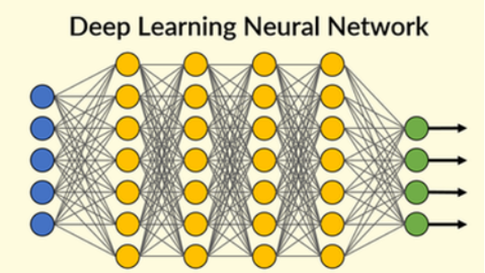
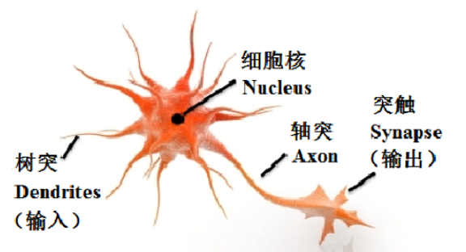
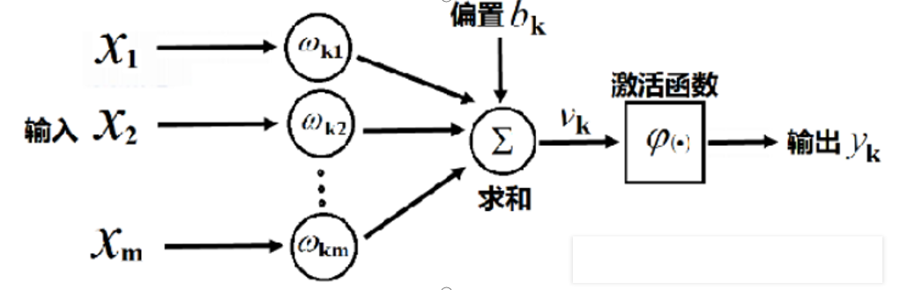

# 第三章：深度学习概述与神经网络基础

## 🎯 本章目标
- 理解深度学习与传统机器学习的本质区别（特征工程的解放）。
- 了解神经网络的生物学起源，掌握 M-P 神经元模型。
- 掌握 PyTorch 的保姆级安装与环境验证。
- 学会使用 PyTorch 定义最基础的"神经层"。

---

## 一、什么是深度学习（Deep Learning）

深度学习是机器学习的一个分支，它通过**多层神经网络**来自动提取特征、学习数据规律。

### 1. 深度学习与机器学习的关系


| 对比维度 | 传统机器学习（ML） | 深度学习（DL） |
| :--- | :--- | :--- |
| **特征提取** | 需人工提取（如边缘、纹理等） | **自动学习多层特征** |
| **模型结构** | 相对简单（如SVM、决策树） | 多层非线性网络（如CNN、RNN） |
| **数据需求** | 适中 | **极大，依赖大规模数据** |
| **应用场景** | 表格型数据、结构化数据 | 图像、语音、文本等非结构化数据 |

---

## 二、神经网络的起源

神经网络受人脑神经系统启发，是一个能**自动学习输入与输出之间复杂关系的非线性函数逼近器**。

### 1. 生物神经细胞结构
神经网络的每一个"圆圈"其实都在模仿大脑里的这个细胞。


### 2. M-P 神经元模型 (1943年)
这是人工神经网络的最早数学模型，模拟了生物神经元的工作机制。


---

## 三、🚀 PyTorch 保姆级安装指南

### 1. 准备工作 见第一章内容

### 2. 验证安装
```python
import torch
print("PyTorch版本:", torch.__version__)
print("CUDA是否可用:", torch.cuda.is_available())
```

---

## 四、PyTorch 里的"积木"：Linear 层

在代码中，我们用 `torch.nn.Linear` 来实现刚才看到的 M-P 模型。

**代码：`01_神经网络搭建.py`**

```python
import torch
import torch.nn as nn

layer1 = nn.Linear(in_features=5, out_features=7, bias=True)
layer2 = nn.Linear(in_features=7, out_features=10, bias=True)
output_layer = nn.Linear(in_features=10, out_features=2, bias=True)

print("第一层:", layer1)
print("第二层:", layer2)
print("输出层:", output_layer)

print("第一层权重形状:", layer1.weight.shape)
print("第一层偏置形状:", layer1.bias.shape)
```

---

## 💡 本章小结
- 自动特征提取：DL 的核心。
- M-P 模型：神经网络的数学鼻祖。
- torch.nn.Linear：搭建网络的基本积木。

## 🏠 课后思考
- 如果我们要识别一个 28x28 像素的手写数字图片，`in_features` 应该是多少？
