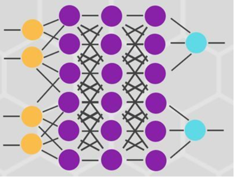

# 章四：神经网络基础与前向/反向传播

## 🎯 本章目标
- 理解神经网络的完整身体结构（输入、隐藏、输出层）。
- 掌握 **前向传播 (Forward)**：模型是怎么根据输入"盲猜"出答案的。
- 掌握 **反向传播 (Backward)**：模型猜错了，是如何通过梯度进行"灵魂反省"的。
- 实战：不调包，手动实现一个逻辑门，看清底层数学真相。

---

## 一、神经网络的"身体结构"

一个完整的神经网络通常由三部分组成：



1. **输入层 (Input Layer)**：负责接收原始数据（如：图像像素、医疗指标）。
2. **隐藏层 (Hidden Layer)**：神经网络的"加工车间"，负责提取数据背后的深层规律。
3. **输出层 (Output Layer)**：负责给出最终结论（如：识别出是"猫"还是"狗"）。

---

## 二、模型是如何"思考"的？ —— 前向传播

**前向传播 (Forward Propagation)** 是数据从左向右流动的过程：

1. **信号进入**：数据 $x$ 进入神经元。
2. **加工处理**：计算加权求和 $z = w \cdot x + b$。
3. **激活释放**：通过激活函数（如 ReLU）得到输出 $a$。
4. **传递接力**：将输出 $a$ 传给下一层，直到输出层产生预测结果 $\hat{y}$。

---

## 三、模型是如何"自省"的？ —— 反向传播

如果模型预测的结果是 0.1，而真实标签是 1.0，说明模型"猜错了"。

**反向传播 (Backward Propagation)** 是模型修正错误的核心机制：

1. **计算损失 (Loss)**：量化模型错得有多离谱。
2. **寻找罪魁祸首 (Gradient)**：通过微积分的**链式法则**，算出每个权重 $w$ 对错误负多大责任。
3. **微调更新**：根据责任大小，反向修改权重 $w$。

> 💡 **金句**：前向传播是"大胆假设"，反向传播是"小心求证"。

---

## 四、实战：手动实现一个"与门" (AND Gate)

在不用 PyTorch 自动求导的情况下，我们通过手动设置权重 $w$ 和偏置 $b$ 来模拟神经网络。

| 输入 A | 输入 B | 期望输出 |
| :---: | :---: | :---: |
| 0 | 0 | 0 |
| 0 | 1 | 0 |
| 1 | 0 | 0 |
| 1 | 1 | 1 |

设置 $w_1=1.0, w_2=1.0, b=-1.5$。
只有当 A 和 B 都是 1 时，$1+1-1.5 = 0.5 > 0$，输出才会激活为 1。

**代码：`02_手动实现逻辑门.py`**

```python
import torch

def and_gate(x1, x2):
    w1 = 1.0
    w2 = 1.0
    b = -1.5
    z = x1 * w1 + x2 * w2 + b
    output = 1 if z > 0 else 0
    return output

print("--- 与门 (AND Gate) 运行结果 ---")
print(f"输入 (0, 0) -> 预测输出: {and_gate(0, 0)}")
print(f"输入 (0, 1) -> 预测输出: {and_gate(0, 1)}")
print(f"输入 (1, 0) -> 预测输出: {and_gate(1, 0)}")
print(f"输入 (1, 1) -> 预测输出: {and_gate(1, 1)}")
```

---

## 💡 本章小结
- 前向传播：计算预测值的流水线。
- 反向传播：更新权重的修正液。
- 隐藏层：深度学习之所以"深"的原因。

## 🏠 课后思考
- 如果没有反向传播，模型还能通过"看照片"学会识别物体吗？
- 为什么隐藏层越多，模型的识别能力往往越强？
