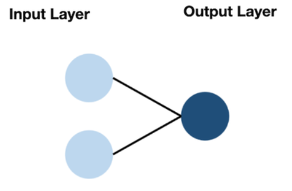

# 章五：激活函数、损失函数与优化器

## 🎯 本章目标
- 理解 **激活函数** 的必要性：为什么没有它，神经网络只是在做"无用功"？
- 掌握 **损失函数** 的选择：如何根据任务量化"痛苦"？
- 领会 **优化器** 的精髓：如何用最聪明的方法找到那组"黄金权重"？

---

## 一、激活函数 (Activation Function) —— 赋予模型"灵性"

如果只有 $y = wx + b$，无论堆多少层，本质上还是一条直线。激活函数的作用就是把直线"掰弯"，赋予模型处理复杂非线性问题的能力。

### 1. 常用激活函数对比


- **Sigmoid**：老前辈，输出 0~1。缺点：容易产生"梯度消失"，让模型学不动。
- **Tanh**：Sigmoid 的改进版，输出 -1~1，关于原点对称，收敛更快。
- **ReLU (目前最主流)**：简单粗暴，负数全变 0，正数照旧。优点：计算极快，有效缓解梯度消失。
- **Leaky ReLU**：给负数区留一点点缝隙（如 0.01），防止神经元彻底"死掉"。

---

## 二、损失函数 (Loss Function) —— 衡量"错误"的尺子

模型猜得对不对，全看 Loss 值。

| 任务类型 | 推荐损失函数 | PyTorch 代码 |
| :--- | :--- | :--- |
| **回归任务** (预测房价、气温) | **MSE** (均方误差) | `nn.MSELoss()` |
| **多分类任务** (猫狗识别) | **CrossEntropy** (交叉熵) | `nn.CrossEntropyLoss()` |
| **二分类任务** (是/否判断) | **BCE** (二元交叉熵) | `nn.BCELoss()` |

---

## 三、优化器 (Optimizer) —— 模型更新的"大脑"

优化器的任务是根据反向传播算出的梯度，去更新权重 $w$。

1. **SGD (随机梯度下降)**：最基础的方法，一步一个脚印，但容易在坑里"绕圈"。
2. **Momentum (动量法)**：引入物理学惯性，利用之前的速度加速冲出"坑洞"。
3. **Adam (全能选手)**：自适应调整学习率，目前 90% 情况下的首选。
4. **AdamW (顶配版)**：在 Adam 基础上优化了权重衰减，是 Transformer 和大模型的标配。

---

## 四、代码框架：三位一体

**代码：`03_灵魂三要素示例.py`**

```python
import torch
import torch.nn as nn
import torch.optim as optim

model = nn.Sequential(
    nn.Linear(5, 10),
    nn.ReLU(),
    nn.Linear(10, 2)
)

criterion = nn.MSELoss()
optimizer = optim.Adam(model.parameters(), lr=0.01)

inputs = torch.randn(1, 5)
labels = torch.randn(1, 2)

optimizer.zero_grad()
outputs = model(inputs)
loss = criterion(outputs, labels)
print(f"当前 Loss 值: {loss.item()}")
loss.backward()
optimizer.step()
```

---

## 💡 本章小结
- 激活函数：管"非线性"。
- 损失函数：管"打分"。
- 优化器：管"修正"。

## 🏠 课后作业
- 思考：如果我们将所有层的激活函数都去掉，增加 100 层隐藏层，模型的能力会变强吗？
