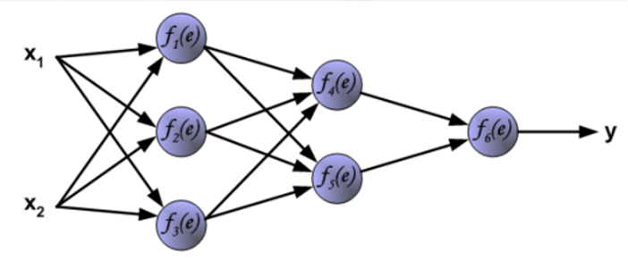

# 章六：PyTorch 入门与张量 (Tensor) 运算

## 🎯 本章目标
- 理解什么是 **Tensor**：深度学习世界的"基本粒子"。
- 掌握 Tensor 的维度（Shape）与数据类型（Dtype）。
- 学会如何将数据从 CPU 搬运到 **GPU**：开启加速模式。
- 动手实战：掌握 Tensor 的创建、索引、切片与数学运算。

---

## 一、什么是 Tensor？—— 不仅仅是数组

在深度学习中，所有的信息（图片、声音、文本、权重）最终都会变成一堆数字。这些数字的载体就是 **Tensor (张量)**。

### 1. 维度的力量
- **0维**：标量 (Scalar)，就是一个数。
- **1维**：向量 (Vector)，一排数（如：一条患者记录）。
- **2维**：矩阵 (Matrix)，一张表（如：黑白图片）。
- **3维及以上**：张量 (Tensor)，（如：彩色图片 C*H*W，或者视频序列）。



---

## 二、Tensor 的"身份证"：核心属性

每一个 Tensor 都有三个最重要的属性：
1. **Shape (形状)**：它长什么样？（如：`[3, 224, 224]` 表示 3 通道 224x224 的图片）。
2. **Dtype (数据类型)**：它是整数还是小数？（常用：`float32`）。
3. **Device (设备)**：它存在哪儿？（`cpu` 还是 `cuda` 显卡）。

---

## 三、🚀 速度的关键：GPU 搬运工

Tensor 与 NumPy 数组最大的区别在于：它可以在 GPU 上飞速运行。

```python
device = "cuda" if torch.cuda.is_available() else "cpu"
x = x.to(device)
```
> 💡 **提示**：只有当所有参与运算的 Tensor 都在同一个设备上时，运算才能成功！

---

## 四、常用张量算子

| 操作 | 代码示例 | 物理意义 |
| :--- | :--- | :--- |
| **创建** | `torch.zeros()`, `torch.randn()` | 初始化"白纸"或"随机噪音" |
| **变形** | `x.view()`, `x.reshape()` | 改变数据的观察视角（不改数据本身） |
| **转置** | `x.T` 或 `x.transpose()` | 矩阵行列互换 |
| **拼接** | `torch.cat()` | 将多个数据块合并在一起 |

---

## 五、完整代码实战

**代码：`04_张量运算实战.py`**

```python
import torch

data = [[1, 2], [3, 4]]
x = torch.tensor(data)
x_rand = torch.randn(2, 3)

print(f"张量的形状: {x_rand.shape}")
print(f"张量的数据类型: {x_rand.dtype}")
print(f"张量所在的设备: {x_rand.device}")

if torch.cuda.is_available():
    device = torch.device("cuda")
    x_gpu = x_rand.to(device)
    print(f"现在张量在: {x_gpu.device}")
else:
    print("当前环境没有 GPU，继续用 CPU。")

x_flat = x_rand.view(1, 6)
print(f"变形后的形状: {x_flat.shape}")

a = torch.ones(2, 2)
b = torch.ones(2, 2)
result = a + b
print("张量加法结果:\n", result)
```

---

## 💡 本章小结
- Tensor 是数据的容器。
- `.to(device)` 是提速的密码。
- 维度匹配是搭建网络的地基。

## 🏠 课后作业
- 尝试创建一个 `[1, 3, 28, 28]` 的随机张量，代表一张彩色数字图片。
- 查阅文档：`view()` 和 `reshape()` 有什么细微区别？
