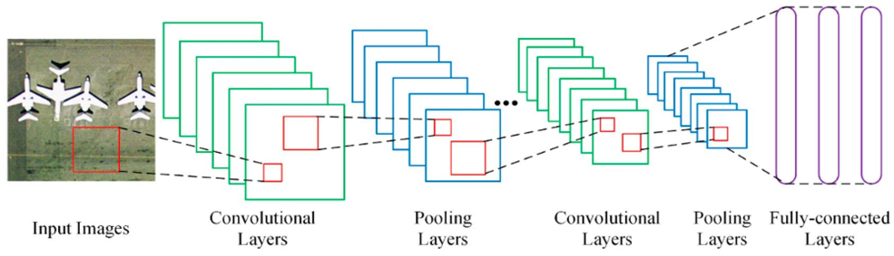
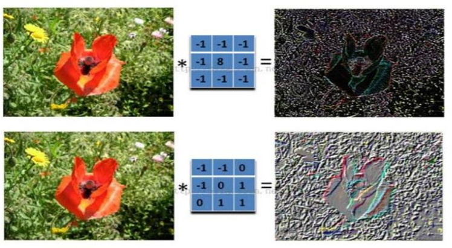
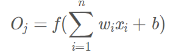
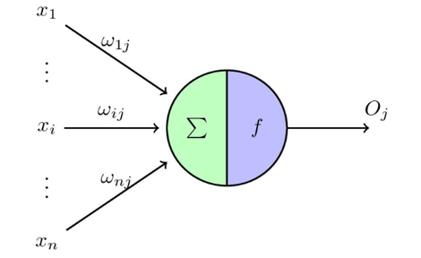
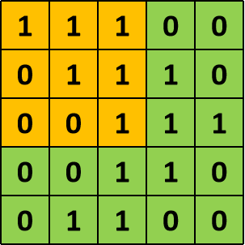
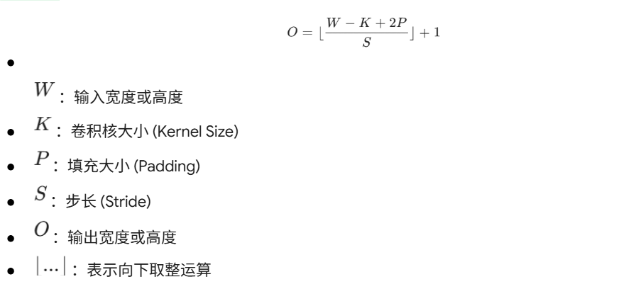
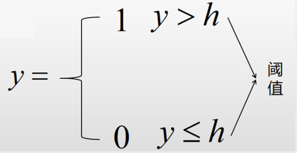
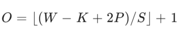
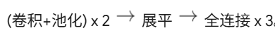

# **全局导读：知识主线串联（从 Day 1 到 Day 2）**

为了让大家建立清晰的深度学习知识体系，在正式上课前，我们先梳理一下目前的**学习主线**：

* **基建层 (Day 1\)**：我们学习了 **Git**，这是为了保证团队协作时代码不乱；配置了 **Conda 和 PyTorch**，这是为了给我们提供运算的“工厂环境”。  
* **数据层 (Day 1\)**：引入了 **Tensor (张量)**，这是因为 GPU 只认识这种特殊的数据结构，它是我们在神经网络里搬运的“砖块”。  
* **模型层 (Day 1\)**：我们手写了逻辑门，了解了 **全连接层 (Linear) \+ 激活函数 (ReLU)**。它是最基础的特征处理车间。  
* **破局层 (Day 2 本节核心)**：但是！全连接层在处理“图像”这种二维复杂数据时，暴露出了致命缺陷（破坏结构、显存炸裂）。为了解决这个问题，今天我们必须引入全新的超级武器 —— **卷积神经网络 (CNN)**。

**今日逻辑主线**：发现 FC 的痛点 --> 引入 CNN 的局部感知 -->  拆解 CNN 的核心零件（卷积核、步长、填充、池化） -->  组装成一台真正能用的历史级图像识别机器（LeNet-5）。

# **第一章：进化 —— 为什么全连接层搞不定图像？**

**【逻辑承接】**：昨天我们学的全连接网络（FC）能处理简单数据，但一旦面对图像数据，它就会暴露出两大核心瓶颈。理解了痛点，你才能明白为什么我们需要 CNN。

## **🎯 本章目标**

* 深刻理解全连接网络（FC）处理图像时的两大致命缺陷。  
* 掌握卷积神经网络（CNN）的两大核心破局理念：局部感知与权值共享。

## **一、传统全连接网络（FC）的局限性**

在 Day 1 中，我们将 28x28 的图片展平为 784 维向量。这样做存在两个严重问题：

### **1\. 空间结构被破坏**

* 图像数据的核心价值在于像素间的“二维物理相邻关系”。猫的眼睛离鼻子很近，离尾巴很远。  
* \*\*拉平（Flatten）\*\*操作直接无视了这种二维位置关系，彻底打断了像素的空间连续性，导致模型被迫在一维序列中重新学习复杂的二维结构，学习难度急剧加大。

### **2\. 参数量爆炸**

* **算笔账**：假设输入一张 1024x1024 分辨率的彩色图片（3 通道 RGB），输入特征就是 1024x1024 x3≈314万。  
* 如果第一层隐藏层有 1000 个神经元，那么仅仅这一层的权重 W 参数量就是 **31.4 亿个**！  
* **直接后果**：显存瞬间炸裂，计算量大到普通硬件无法承受；且参数量远大于训练样本，极易导致模型过拟合（死记硬背）。

## **二、CNN 的救赎：模拟人类视觉**

人类看图片，不是一次性盯着每一个像素看，而是通过“局部扫描”来识别特征。CNN 完美借鉴了这一机制：

### **1\. 局部感受野 (Local Receptive Field)**

* 每个神经元不再盯着整张图，而是只盯一小块区域（如 3x3 的窗口）。  
* **类比**：拿放大镜一行一行地扫描报纸上的文字。  
* **理论依据**：图像中距离相近的像素点关联性强，仅通过局部特征组合，即可逐层抽象出全局特征。

### **2\. 权值共享 (Weight Sharing)**

* 在整张图上滑动的那个“放大镜”（卷积核），其内部的参数在整张图片上是**固定不变**的。  
* 无论猫出现在左上角还是右下角，我们都用同一个“猫耳检测器”去扫。  
* **效果**：由于整图共用一个 3x3 的卷积核，无论输入图像多大，提取该特征的参数量恒定为 9 个（加 1 个偏置），参数量从“亿级”瞬间降到“百级”，实现真正的降维打击。

## **三、CNN 的基本流水线**

1. **输入图片 (INPUT)**：保留 HxW x3（高 x 宽 x 通道数）的原始立体结构。  
2. **卷积提取 (CONV)**：核心计算层，自动抓取纹理、边缘等多维度局部特征。  
3. **激活与池化 (ACT/POOL)**：引入非线性变换，并对特征图进行空间降维、过滤次要信息。  
4. **全连接分类 (FC)**：在网络尾端，将高度抽象后的低分辨率特征图展平，汇总所有特征得出分类结论。

# **第二章：内核 —— 卷积运算与特征图 (Feature Map)	**

**【逻辑承接】**：既然 CNN 的核心武器是“局部扫描”，那这个扫描动作在底层数学上到底是怎么计算的？代码又是如何实现的？本章揭秘。

## **🎯 本章目标**

* 深刻理解 **卷积核 (Kernel)** 的物理意义：它到底在找什么？  
* 掌握 **卷积运算** 的精细步骤：对应位置相乘再求和。  
* 认识 **特征图 (Feature Map)**：看懂模型提取出的“中层秘密”。  
* **初识代码**：掌握 torch.nn.Conv2d 的基本调用。

## **一、卷积核：AI 的“显微镜”**

卷积核（也叫滤波器 Filter）是卷积层的核心零件，是一个含有可训练参数 W 的小型矩阵。它就像一把特制的尺子，用来丈量图像中的局部模式。

* **横线核**：里面的数字排列能对水平线条产生强烈反应。  
* **竖线核**：对垂直边界产生强烈反应。  
* **权重 W**：卷积核里的每一个数字，就是模型通过反向传播需要不断学习优化的参数。卷积的过程，实质上就是计算图像局部区域与卷积核的内积相似度。

## **二、卷积运算：步步为营**

卷积运算不是什么高深的魔法，而是极其简单的**局部算术**。

1. **覆盖区域**：将卷积核覆盖在图像的一个局部区域（如 3x3）。  
2. **位置对齐**：将卷积核的权重与图像像素点一一对应。  
3. **乘加操作**：对应位置相乘，最后全部加起来。  
4. **加上偏置**：再加上一个偏置项 b。  
5. **产出结果**：得到特征图上的一个单一标量点。随着卷积核按步长扫描完整张图片，最终输出一个全新的二维矩阵。

## **三、特征图：图像的“浓缩精华”**

卷积扫完之后，生成的不再是颜色值，而是特征强度。

* **激活区域**：特征图中数值越大的地方，代表原图在该位置与当前卷积核寻找的特征匹配度越高（该特征被强烈激活）。  
* **语义抽象**：随着网络加深，特征图会从简单的“线条、边缘”变成复杂的“器官”或“轮廓”。  
* **注意**：一个卷积核只能提取一种特征，产生一张特征图。找多种特征需设置多个独立卷积核（即 out\_channels 参数）。

## **四、PyTorch 核心积木：Conv2d (代码实战)**

import torch  
import torch.nn as nn

\# 1\. 模拟一张彩色输入图片  
\# 形状：\[1, 3, 28, 28\] \-\> \[批次大小, 通道数(RGB), 高, 宽\]  
input\_image \= torch.randn(1, 3, 28, 28\)

\# 2\. 定义一个卷积层  
\# 注意 in\_channels 必须和输入图片的通道数一模一样！  
\# out\_channels=16 意味着我们派出了 16 个侦探，每个人找一种不同的特征。  
conv\_layer \= nn.Conv2d(  
    in\_channels=3,   
    out\_channels=16,   
    kernel\_size=3,   
    stride=1,   
    padding=1  
)

\# 3\. 执行卷积运算（前向传播）  
output\_features \= conv\_layer(input\_image)

\# 4\. 观察结果  
print("--- 维度对比 \---")  
print(f"输入图片形状: {input\_image.shape}")  
print(f"输出特征图形状: {output\_features.shape}")

\# 5\. 窥探卷积核的“大脑”  
\# 卷积核里的权重就是我们要训练的参数  
print("\\n--- 卷积核详情 \---")  
print(f"卷积核权重形状: {conv\_layer.weight.shape}") 

# **第三章：工程调优 —— 步长、填充与多通道的奥秘**

**【逻辑承接】**：会写基础卷积还不够。在实际搭建网络时，图像边缘的特征容易丢失，且深层网络会导致图像越缩越小。为了精准控制特征图的尺寸（排障查错的核心技能），我们必须掌握步长（Stride）和填充（Padding）。

## **🎯 本章目标**

* 理解 **Padding (填充)**：如何给图像套上“救生圈”以保住边缘特征。  
* 掌握 **Stride (步长)**：如何通过“跨步走”实现高效降维。  
* 精通 **尺寸计算公式**：像架构师一样精准预测特征图的大小。  
* 深入 **多通道卷积**：理解 RGB 彩色图像是如何被三维卷积核处理的。

## **一、Padding：给图像套个“救生圈”**

如果不加 Padding，每经过一层卷积，图像就会“缩水”一圈，深层网络会导致图像迅速塌缩为零，同时边缘信息也会丢失。

* **作用 1：保持尺寸**。在原图像素矩阵外围填充一圈 0，让输出的特征图和输入一样大（Same Padding）。  
* **作用 2：保护边缘**。让边缘像素也能被卷积核多次扫描，充分提取更多特征。

## **二、Stride：卷积核的“变速箱”**

Stride 决定了卷积核每次滑动的物理像素点距离。

* **Stride \= 1**：精细扫描，保留所有细节。  
* **Stride \= 2**：跨步扫描，输出尺寸将成比例减半，实现**降维**和**提速**。  
* **实战意义**：在不增加参数的情况下，快速扩大模型的感受野。

## **三、核心公式：输出尺寸预测 (重点必背)**

这是每个 CNN 架构师在设计网络时必须背诵的“设计图纸”公式。全连接层是否会报错，全靠这个公式推演：

## **四、多通道卷积：三头六臂**

彩色照片（RGB）有 3 个通道，因此卷积核也必须是“三层的”（三维立体）。

1. **三层合一**：卷积核的每一层分别与对应通道进行矩阵内积运算。  
2. **汇总求和**：将三个通道的结果对应位置相加，再加上一个偏置  b。  
3. **核心推论**：无论输入有多少层，一个完整的三维卷积核只产生**一层**特征通道。想要 16 层特征图，就需要配置 16 个独立的卷积核。

## **五、代码实战：尺寸调优与验证	**

import torch  
import torch.nn as nn

\# 我们使用一个 32x32 的假图像来做实验。  
\# 卷积核统一使用 3x3。  
input\_img \= torch.randn(1, 1, 32, 32\) \# \[批次, 通道, 高, 宽\]

\# 1\. 默认情况：Stride=1, Padding=0  
conv\_default \= nn.Conv2d(1, 1, kernel\_size=3, stride=1, padding=0)  
out\_default \= conv\_default(input\_img)  
print(f"默认情况 (P=0, S=1) 输出: {out\_default.shape}") \# 预期 30x30

\# 2\. 加入 Padding：保持尺寸 (Same Padding)  
conv\_padding \= nn.Conv2d(1, 1, kernel\_size=3, stride=1, padding=1)  
out\_padding \= conv\_padding(input\_img)  
print(f"加入填充 (P=1, S=1) 输出: {out\_padding.shape}") \# 预期 32x32

\# 3\. 改变 Stride：跨步降维  
conv\_stride \= nn.Conv2d(1, 1, kernel\_size=3, stride=2, padding=1)  
out\_stride \= conv\_stride(input\_img)  
print(f"跨步走 (P=1, S=2) 输出: {out\_stride.shape}") \# 预期 16x16

\# 4\. 验证架构师公式  
\# O \= (W \- K \+ 2P) / S \+ 1  
\# 代入：(32 \- 3 \+ 2\*1) / 2 \+ 1 \= 31 / 2 \+ 1 \= 15.5 \+ 1 \-\> 取整 16

\# 5\. 多通道权重展示  
conv\_multi \= nn.Conv2d(in\_channels=3, out\_channels=16, kernel\_size=3)  
print(f"\\n多通道卷积权重维度: {conv\_multi.weight.shape}")  
\# \[16, 3, 3, 3\] \-\> 16组独立核 x (3通道 x 3x3)

# **第四章：精简提效 —— 池化层 (Pooling)**

**【逻辑承接】**：卷积层虽然大幅减少了参数，但特征图分辨率依然很大，计算量依然惊人。如何能在保留核心特征的前提下，进一步“暴力缩减”数据量，并让模型具备“防抖动”能力？引入池化层！

## **🎯 本章目标**

* 理解 **池化 (Pooling)** 的核心逻辑：为什么“抓大放小”能让模型更强？  
* 掌握 **最大池化 (Max Pooling)** 与 **平均池化 (Average Pooling)** 的区别。  
* **初识代码**：掌握 nn.MaxPool2d 的调用。

## **一、池化层：神经网络的“筛选员”**

池化层（Pooling Layer，或称下采样层）通常紧跟在卷积层之后，它的主要职责是“特征暴力降维”。

### **1\. 最大池化 (Max Pooling) —— “只看最亮的仔”**

在滑动窗口内，摒弃其他数据，只取最大值作为输出。

* **物理意义**：只要区域内出现了某个特定的强特征（如猫耳朵被强烈激活），我就记下它的最大强度，直接忽略周围的细微干扰。

### **2\. 平均池化 (Average Pooling) —— “雨露均沾”**

在滑动窗口内，取所有像素的平均值。保留背景的平滑度，目前在特征分类任务中极少使用。

## **二、为什么一定需要池化层？**

1. **极其强悍的维度压缩**：标准的 2x2 池化能直接减少 75% 的空间数据量，大幅提升计算速度并缓解全连接层的内存压力。  
2. **平移不变性 (Invariance)**：即使目标物体在图像中发生了微小的偏移或形变，最大池化仍能稳定捕获局部最强特征。这让模型具有了强大的“抗干扰与防抖”功能。  
3. **零参数优势**：池化层是纯粹的统计计算，没有任何需要训练的权重参数（无 W 和 b），不会增加模型的训练负担。

## **三、代码实现：最大池化推演**

import torch  
import torch.nn as nn

\# 模拟一张 4x4 的单通道灰度图，用具体的数字来看看最大池化是怎么算的。  
input\_img \= torch.tensor(\[\[\[  
    \[1.0, 2.0, 3.0, 4.0\],  
    \[5.0, 6.0, 7.0, 8.0\],  
    \[9.0, 10.0, 11.0, 12.0\],  
    \[13.0, 14.0, 15.0, 16.0\]  
\]\]\])

\# 1\. 定义最大池化层  
\# 池化层的 stride 默认等于 kernel\_size。  
\# 这意味着窗口在滑动时不会重叠，正好把图像切成干净的小块。  
max\_pool \= nn.MaxPool2d(kernel\_size=2, stride=2)

\# 2\. 执行池化  
output \= max\_pool(input\_img)

\# 3\. 观察结果  
print("--- 原始图像 (4x4) \---")  
print(input\_img\[0, 0\])  
print("\\n--- 池化后图像 (2x2) \---")  
print(output\[0, 0\])

\# 4\. 参数检查  
params \= list(max\_pool.parameters())  
print(f"\\n池化层的参数数量: {len(params)}")   
\# 注意：池化层是确定性的统计筛选，内部没有任何需要训练的权重 W 和偏置 b！

# **第五章：集大成者 —— LeNet-5 架构深度拆解**

**【逻辑承接】**：兵器都讲完了，现在是检验真理的时候。我们把今天学的卷积（提特征）、填充/步长（控尺寸）、池化（降维防抖），和昨天学的全连接（逻辑分类）全部组合起来，就能搭建出深度学习历史上最经典的一台机器：LeNet-5。

## **🎯 本章目标**

* 了解 **LeNet-5** 的历史背景：CNN 的开山之作。  
* 掌握 LeNet-5 的 **七层结构**：卷积、池化、全连接的完美组合范式。  
* 练习 **维度追踪**：亲手推导出每一层输出特征图的 Shape 变化。  
* **综合实战**：掌握 nn.Module 类定义复杂串联网络的方法。

## **一、LeNet-5：深度学习的“开山鼻祖”**

由 AI 三巨头之一的 **Yann LeCun (杨立昆)** 在 1998 年提出，最初用于美国邮政系统识别手写邮政编码，一举确立了现代深度学习处理图像数据的底层框架。

## **二、逐层深度剖析 (重点必考：所有网络复现的基础)**

从输入到输出最严谨的特征图维度变化推导（请结合上一章的架构公式仔细验算）：

| **层级** | **类型** | **参数 (Kernel/Stride/Padding)** | **输出形状 (C, H, W)** | **作用** |

| **输入层** | INPUT | 原始规范化单通道图片 | (1, 32, 32\) | 基础数据源 |

| **C1 层** | 卷积 | 6个 5x5 核, P=0, S=1

计算: (32-5)/1 \+ 1 \= 28 | **(6, 28, 28\)** | 提取基础边缘特征 |

| **S2 层** | 池化 | 2x2 窗口, S=2

计算: 28 / 2 \= 14 | **(6, 14, 14\)** | 第一次瘦身, 防抖抗噪 |

| **C3 层** | 卷积 | 16个 5x5 核, P=0, S=1

计算: (14-5)/1 \+ 1 \= 10 | **(16, 10, 10\)** | 提取复杂抽象特征 |

| **S4 层** | 池化 | 2x2 窗口, S=2

计算: 10 / 2 \= 5 | **(16, 5, 5\)** | 第二次瘦身, 浓缩精华 |

| **Flatten** | 展平 | 立体特征矩阵拍扁拉直

计算: 16通道 \* 5高 \* 5宽 \= 400 | **(400)** | 承上启下的张量形态转换 |

| **C5 / F5** | 全连接 | 400 维输入，映射至 120 维 | **(120)** | 逻辑维度汇总 |

| **F6 层** | 全连接 | 120 维输入，映射至 84 维 | **(84)** | 进一步特征提炼 |

| **输出层** | 全连接 | 最终分类，映射至 10 | **(10)** | 输出 0-9 数字分类概率 |

## **三、LeNet-5 的伟大创新总结**

1. **局部感知**：打破全局链接，通过卷积核只看局部，保留空间结构。  
2. **下采样**：利用无参数的池化层，在保留核心特征的同时大幅减少计算量。  
3. **权值共享**：彻底颠覆了参数堆叠的模式，降低了模型的训练难度与硬件门槛。  
4. **范式奠基**：确立了 \[特征提取：卷积 \-\> 激活 \-\> 池化\] 循环 \+ \[分类器：全连接\] 的黄金架构。

## **四、PyTorch 实现模板**

import torch  
import torch.nn as nn  
import torch.nn.functional as F

\# \================================================================= \#  
\# 经典 LeNet-5 架构复现 —— 深度学习的圣经  
\# \================================================================= \#

class LeNet5(nn.Module):  
    def \_\_init\_\_(self):  
        super(LeNet5, self).\_\_init\_\_()  
          

        \# 阶段一：初级特征提取
        \# C1 卷积层：输入 1 个通道（灰度图），输出 6 个特征图  
        self.conv1 \= nn.Conv2d(in\_channels=1, out\_channels=6, kernel\_size=5)  
        \# S2 池化层：2x2 窗口，步长 2  
        self.pool1 \= nn.MaxPool2d(kernel\_size=2, stride=2)  
          
        \# 阶段二：高级特征提取  
        \# C3 卷积层：输入 6，输出 16  
        self.conv2 \= nn.Conv2d(in\_channels=6, out\_channels=16, kernel\_size=5)  
        \# S4 池化层：再次减半  
        self.pool2 \= nn.MaxPool2d(kernel\_size=2, stride=2)  
          
        \# 阶段三：逻辑分类器准备  
        \# 经过两次卷积和池化，32x32 的图变成了 5x5。  
        \# 展平后的核心输入维度是：16个通道 \* 5 \* 5 \= 400。  
          
        \# F5 全连接层  
        self.fc1 \= nn.Linear(16 \* 5 \* 5, 120\)  
        \# F6 全连接层  
        self.fc2 \= nn.Linear(120, 84\)  
        \# 输出层：对应 0-9 共 10 个数字  
        self.fc3 \= nn.Linear(84, 10\)
    
    def forward(self, x):          
        \# 结构区块 1：卷积 \-\> ReLU 激活 \-\> 池化  
        x \= self.pool1(F.relu(self.conv1(x)))  
          
        \# 结构区块 2：卷积 \-\> ReLU 激活 \-\> 池化  
        x \= self.pool2(F.relu(self.conv2(x)))  
          
        \# 展平连接层：将多维特征图拍扁，准备进入分类器  
        x \= x.view(-1, 16 \* 5 \* 5\)  
          
        \# 全连接层逻辑推断  
        x \= F.relu(self.fc1(x))  
        x \= F.relu(self.fc2(x))  
        \# 输出层 (最后一般不加激活，或者在损失函数里配合使用)  
        x \= self.fc3(x)  
          
        return x

\# 验证网络结构  
model \= LeNet5()  
print(model)

\# 模拟验证连通性：随机一张 32x32 的图片输入网络  
test\_input \= torch.randn(1, 1, 32, 32\)  
output \= model(test\_input)  
print(f"\\n最终输出维度: {output.shape}") \# 预期 \[1, 10\]

# **Day 2 课后总结与作业**

## **📝 今日 CNN 核心地图 (必背)**

1. **核心痛点**：全连接网络（FC）处理图像时参数量爆炸且破坏二维结构。  
2. **卷积 (Conv)**：利用局部感受野捕获特征，依靠权值共享实现降维。核心三要素：Kernel, Padding, Stride。  
3. **池化 (Pool)**：特征提取中的“抓大放小”，专做降维防抖，且**没有训练参数**。  
4. **核心公式**：决定特征图走向的核心依据。  
5. **LeNet-5 经典组合**：。

## **🏠 今日作业 (Tonight's Mission)**

1. **【必做】纸笔推导**：关闭课件，在白纸上手写出 LeNet-5 网络中，从输入到最后输出每一层的形状变化全过程。  
2. **【必做】跑通代码**：创建工程，运行 04\_LeNet5实现.py，确保没有任何 size mismatch 报错，且最后成功打印输出 \[1, 10\]。  
3. **【挑战】魔改网络**：在 LeNet-5 的源码中，尝试将第一层卷积层（C1）的卷积核大小改成 3x3。请思考并动手修改：代码还要在哪几处地方做同步修改，才能保证最后全连接层不会报错连通？

