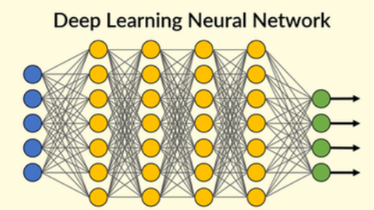
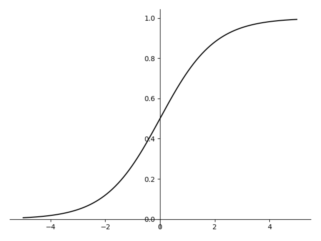
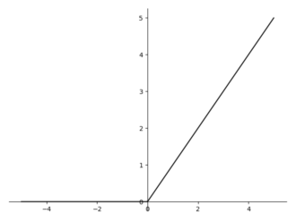
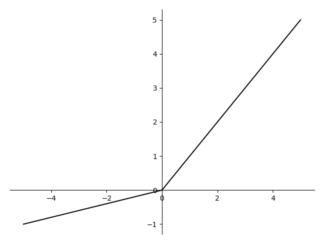
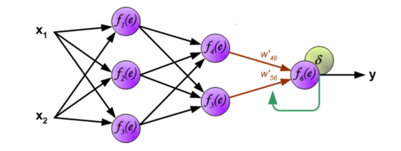
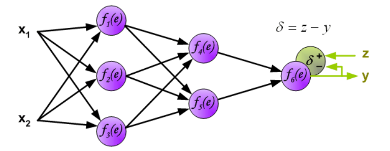
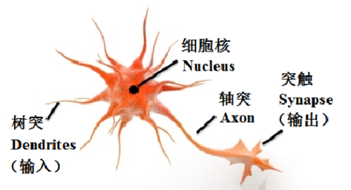
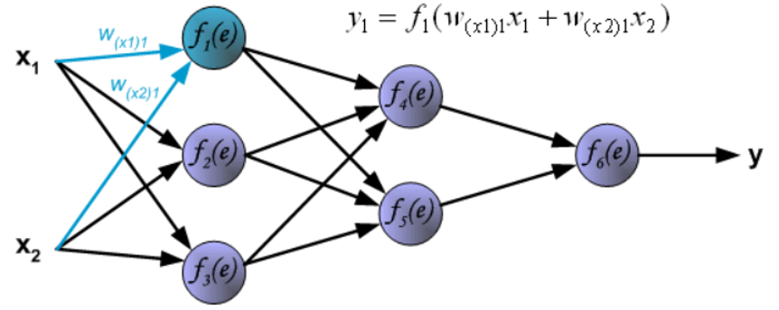

# Day 2 深度学习实操：核心逻辑与全流程进阶

---

## **Part 1 - 全连接层的逻辑原子**

### **1. 什么是全连接层？**

想象你在火车站做一个“智能分流员”。
- **输入 (in_features)**：你有 5 个通道进人。
- **输出 (out_features)**：你有 7 个出口。

**全连接（Fully Connected）的意思是**：每一个入口的每一个人，都有机会走到任何一个出口。
但是！每个出口的保安（神经元）都有自己的脾气：

- 1号保安喜欢穿红衣服的；
- 2号保安喜欢带行李箱的。
这“脾气”就是 **权重 (Weight)**。

### **2. 逻辑公式的深度解构**

神经网络的最底层逻辑其实就是一个极其简单的初中代数公式：
$$y = w_1x_1 + w_2x_2 + ... + w_nx_n + b$$

但在 PyTorch 里，它是以矩阵的形式运行的：
$$Y = X \cdot W^T + b$$

- **X (Input)**: 形状是 `[BatchSize, In_features]`。
- **W (Weight)**: 形状是 `[Out_features, In_features]`。
- **b (Bias)**: 形状是 `[Out_features]`。

### **3. [01_全连接层的奥秘.py] 代码教学**

```python
import torch
import torch.nn as nn

# 1. 模拟 10 个样本，每个样本 5 个特征 (比如：面积, 楼层,房龄, 朝向, 学区等级)
# 形状: [10, 5]
input_data = torch.randn(10, 5)

# 2. 搭建一层全连接
# 这相当于请了 7 个专家对这 5 个原始特征进行重新评估，提炼出 7 个“高级特征”
layer = nn.Linear(in_features=5, out_features=7, bias=True)

# 3. 前向传播
output = layer(input_data)

print(f"输入数据量: {input_data.shape} (10组数据, 每组5个维度)")
print(f"输出数据量: {output.shape} (成功的将数据映射到了7维空间)")

# 4. 查看模型“脑子里”存了什么？
# 既然是 y = wx + b，那模型内部肯定存了 w 和 b
print(f"这就是模型自己随机生成的权重 W:\n{layer.weight}")
print(f"这就是模型自己生成的底气 b (偏置):\n{layer.bias}")
```

### **4. 工业级避坑指南**

1. **为什么参数是随机的？**
   - 初始状态下，模型是个“刚出生的婴儿”，它不知道谁重要，所以先随机猜。
   - 后面我们会用“反向传播”来纠正这些随机数。

2. **bias=True 必须留着吗？**
   - 除非你有极强的数学理由证明数据必须经过原点。
   - **业务场景**：房价预测。即使面积是 0，这个地块本身也有价值。那个 $b$ 就是“保底价”。如果你把 $b$ 删了，你的预测精度会掉一大截。

3. **in_features 填错会怎样？**
   - 模型会直接“心脏骤停（Runtime Error）”。建议先用 `dataset[0].shape` 确认特征数。

### **5. 特征提取层次结构**



- **底层 (像素级)**：识别点、线、面。
- **中层 (结构级)**：识别圆圈、方块、边缘。
- **高层 (语义级)**：识别这到底是个猫头还是个狗腿。

---

## **Part 2 - 激活函数的灵魂实验室**

### **1. 激活函数的本质：引入非线性能力**

- **线性 (Linear)**：只能画直线。不管你叠多少层，最后还是直线。
- **非线性 (Non-Linear)**：能把直线“掰弯”。
- **比喻**：激活函数就是神经网络的**“关节”**。没有关节，你就是一根僵硬的木棍，怎么动都弯不了。

### **2. 三大主流激活函数对比**

#### **2.1 Sigmoid**



- **数学公式**：$\sigma(x) = \frac{1}{1 + e^{-x}}$
- **物理意义**：把所有数值“挤压”到 $(0, 1)$ 之间。
- **工业场景**：它非常像一个“概率门”。因此，它现在几乎只出现在**二分类任务的最后一步**。
- **致命缺陷：梯度消失 (Gradient Vanishing)**。
  - 你看那个 S 型曲线的两头，是不是变得非常平缓？在平缓区，导数（斜率）几乎为 0。

#### **2.2 ReLU (Rectified Linear Unit)**



- **数学公式**：$f(x) = \max(0, x)$
- **优点**：
  1. **计算快**：就是个 `if` 判断。
  2. **不消失**：在正数区，斜率永远是 1。

#### **2.3 LeakyReLU**



- **数学公式**：$f(x) = \begin{cases} x & x > 0 \\ 0.01x & x \le 0 \end{cases}$
- **意义**：它在左半轴留了一个极小的斜率，防止神经元“彻底死亡”。

### **3. [02_激活函数及其导数可视化.py] 代码拆解**

```python
import torch
import torch.nn as nn
import matplotlib.pyplot as plt

# 1. 实验室器材准备：生成 -10 到 10 的 100 个点
# 开启 requires_grad=True，我们要观察它是如何“求导”的
x = torch.linspace(-10, 10, 100, requires_grad=True)

# 2. 挑选实验对象 (可以换成 Tanh, ReLU, Mish 等)
act = nn.Sigmoid() 
y = act(x)

# 3. 反向传播求导！
# 给 y 灌入一个全 1 的“误差信号”，看它回传给 x 多少
y.backward(torch.ones_like(y))
dy_dx = x.grad # 获取 x 坐标上的导数（梯度）

# 4. 图解实验室
plt.figure(figsize=(10, 8))
plt.subplot(2, 1, 1)
plt.plot(x.detach().numpy(), y.detach().numpy(), label="原函数 (特征提取)")
plt.title("激活函数曲线")
plt.legend()

plt.subplot(2, 1, 2)
plt.plot(x.detach().numpy(), dy_dx.numpy(), label="导数曲线 (梯度流动)", color='red')
plt.title("这就是梯度！它决定了模型怎么改参数")
plt.legend()
plt.show()
```

---

## **Part 3 - 损失函数：裁判的哨声**

### **1. 核心映射：损失函数到底是什么？**

- **公式**：$L = f(\text{predict}, \text{label})$
- **理解**：预测值是你的“谎言”，Label（标签）是“现实”。损失函数就是计算你的谎言离现实有多远。
- **博弈论理解**：损失函数就是裁判。裁判判定你错得重，你就得改得狠。

### **2. 工业界四大判决标准**

#### **2.1 MSE (均方误差) —— 回归任务**
- **应用场景**：房价预测、气温预测。
- **特性**：采用了“平方”机制。如果你差一点点，它不怎么罚你；但如果你差得很多，它会由于平方关系重罚。

#### **2.2 CrossEntropy (交叉熵) —— 分类任务**
- **应用场景**：手写数字识别、人脸识别。
- **逻辑**：不仅要求你猜对，还要求你**“非常有信心地猜对”**。

#### **2.3 BCELoss (二元交叉熵)**
- **建议**：直接用 `BCEWithLogitsLoss`，因为它内部整合了 Sigmoid，计算更稳定。

#### **2.4 SmoothL1 (Huber 损失)**
- **工业价值**：它是 MSE 和 L1Loss 的结合体。误差小时像 MSE，误差大时像 L1。

### **3. [03_损失函数.py] 代码解剖**

```python
import torch
import torch.nn as nn

# 模拟：我们模型预测出的原始得分 (Logits)
# 假设是 3 个样本，预测 5 个分类
predict = torch.randn(3, 5)

# 模拟：真实的标签 (必须是 Long 类型，代表类别索引)
label = torch.tensor([1, 0, 4]) 

# 1. 创建裁判：交叉熵裁判
loss_func = nn.CrossEntropyLoss()

# 2. 判决：计算损失
loss = loss_func(predict, label)

# 3. 命令模型反省：反向传播
# 这一步执行后，每一层神经元的 .grad 属性里就有了修正信号
loss.backward()

print(f"当前裁判给出的惩罚分 (Loss): {loss.item()}")
```

### **4. 误差反向传播示意**



---

## **Part 4 - 优化器：寻找山顶的向导**

### **1. 梯度下降下山模型**

1. **摸斜率**：计算梯度。
2. **迈步子**：设置学习率 (Learning Rate)。
3. **重复**：迭代 (Epoch)。

### **2. 工业级向导对比**

#### **2.1 SGD (随机梯度下降)**
- **缺点**：它很“愣”。如果遇到一个稍微平一点的小坑（局部最优），它可能就躺平。

#### **2.2 AdamW：现代 AI 的首选**



- **优势**：
  1. **它有记忆**：记得过去几步是怎么走的。
  2. **它会自己调速**：坡陡慢走，坡缓大步流星。

### **3. [04_优化函数.py] 代码拆解**

```python
import torch
import torch.nn as nn

# 1. 工厂准备模型
model = nn.Sequential(nn.Linear(10, 5), nn.ReLU(), nn.Linear(5, 1))

# 2. 请向导：AdamW
# lr (Learning Rate): 学习率。这是深度学习最重要的“超参数”。
optimizer = torch.optim.AdamW(model.parameters(), lr=0.001)

# 3. 模拟一次训练循环：
for epoch in range(100):
    # --- 重点 1：清空旧账 ---
    # 这一步如果不做，梯度会像垃圾一样堆积，模型会越练越傻。
    optimizer.zero_grad()
    
    # 4. 前向预测
    input_data = torch.randn(1, 10)
    output = model(input_data)
    
    # 5. 裁判吹哨
    loss = (output - 10).abs().mean() # 简单的 Loss 示例
    
    # 6. 计算梯度
    loss.backward()
    
    # --- 重点 2：向导带路 ---
    # 这步执行后，模型的 W 和 b 才会真正被修改！
    optimizer.step()
```

---

## **Part 5 - 回归初体验：让模型学会“转弯”**

### **1. 场景导入**

线性回归只能处理直线逻辑。我们要用神经网络拟合出第一条“弯曲”的线（如 $y = x^2$）。

### **2. [05_神经网络第一次回归预测.py] 代码走读**

```python
import torch
import torch.nn as nn

# --- 坑 1：散装数据 vs 货盘数据 ---
# 错误写法：x = torch.linspace(-1, 1, 100) -> 形状是 [100]
# 正确写法：增加一个维度变成 [100, 1]
x = torch.linspace(-1, 1, 100).unsqueeze(1) 
y = x.pow(2) + 0.1 * torch.rand(x.size()) # 目标是 x 的平方加点噪音

# --- 坑 2：网络的“宽度”决定了“弯多细” ---
class MyRegNet(nn.Module):
    def __init__(self):
        super(MyRegNet, self).__init__()
        # 如果这里填 2，模型拟合出来的是几个生硬的折角
        # 填 10 或 20，模型拟合出来的是完美的曲线
        self.hidden = nn.Linear(1, 20) 
        self.output = nn.Linear(20, 1)
        self.relu = nn.ReLU() # 没它，模型死都弯不了！

    def forward(self, x):
        x = self.relu(self.hidden(x))
        x = self.output(x)
        return x

model = MyRegNet()
optimizer = torch.optim.SGD(model.parameters(), lr=0.1)
criterion = nn.MSELoss()

# --- 坑 3：什么时候停手？ ---
for t in range(200):
    prediction = model(x)
    loss = criterion(prediction, y)
    
    optimizer.zero_grad()
    loss.backward()
    optimizer.step()
```

### **3. 回归空间映射**


---

## **Part 6 - 动态可视化：让模型“学会呼吸”**

### **1. 核心技术：plt.ion()**

在深度学习里，我们需要**一边跑一边画**。
- `plt.ion()`: 开启交互模式。
- `plt.cla()`: 清空坐标轴里的内容（刷画布）。

### **2. [06_训练可视化过程.py] 代码拆解**

```python
import torch
import matplotlib.pyplot as plt

# 1. 准备数据
x = torch.linspace(-1, 1, 100).unsqueeze(1)
y = x.pow(2) + 0.1 * torch.randn(x.size())

# 2. 建立一个简单的 3 层工厂
model = torch.nn.Sequential(
    torch.nn.Linear(1, 20),
    torch.nn.ReLU(),
    torch.nn.Linear(20, 1)
)

optimizer = torch.optim.Adam(model.parameters(), lr=0.05)
loss_func = torch.nn.MSELoss()

# --- 重点：开启实时显示器 ---
plt.ion() 

for i in range(100):
    prediction = model(x)
    loss = loss_func(prediction, y)
    
    optimizer.zero_grad()
    loss.backward()
    optimizer.step()
    
    if i % 5 == 0:
        # --- 重点：刷画布 ---
        plt.cla() # 清空旧的线，不然图片会变成一团乱麻
        plt.scatter(x.numpy(), y.numpy(), c='blue', alpha=0.5, label='真实点')
        plt.plot(x.numpy(), prediction.detach().numpy(), 'r-', lw=5, label='模型的猜测')
        plt.text(0.5, 0, f'Loss={loss.item():.4f}', fontdict={'size': 20, 'color':  'red'})
        plt.legend(loc='upper left')
        plt.pause(0.1) 
plt.ioff(); plt.show()
```

### **3. Loss 下降收敛曲线**



---

## **Part 7 - 加州房价预测案例**

### **1. 工业级回归全流程**

1. **标准化 (Scaling)**：数据对齐。
2. **数据拆分 (Split)**：区分训练集和测试集。
3. **指标考核**：Loss 归 Loss，准确率归准确率。

### **2. [07_加州房价预测案例.py] 代码走读**

```python
import torch
import torch.nn as nn
from sklearn.datasets import fetch_california_housing
from sklearn.model_selection import train_test_split
from sklearn.preprocessing import StandardScaler
import joblib # 记住这个包，它是保存缩放器的关键

# --- 第一步：数据清洗与标准化 ---
data = fetch_california_housing()
X, y = data.data, data.target.reshape(-1, 1)

# 重点：为什么要单独保存缩放器？
# 因为你在部署时，必须用同样的比例去缩放新数据！
scaler = StandardScaler()
X_scaled = scaler.fit_transform(X)
joblib.dump(scaler, 'California_Scaler.pkl')

# --- 第二步：转换 Tensor ---
X_train, X_test, y_train, y_test = train_test_split(X_scaled, y, test_size=0.2)
X_train = torch.FloatTensor(X_train)
y_train = torch.FloatTensor(y_train)

# --- 第三步：搭建“深层”工厂 ---
model = nn.Sequential(
    nn.Linear(8, 64),  # 加州房价有 8 个输入特征
    nn.ReLU(),
    nn.Linear(64, 32), # 隐藏层 1
    nn.ReLU(),
    nn.Linear(32, 1)   # 输出层 1 (房价是个具体数值)
)

# --- 第四步：AdamW 向导登场 ---
optimizer = torch.optim.AdamW(model.parameters(), lr=0.01)
criterion = nn.MSELoss()

for epoch in range(500):
    prediction = model(X_train)
    loss = criterion(prediction, y_train)
    
    optimizer.zero_grad()
    loss.backward()
    optimizer.step()
    
    if epoch % 100 == 0:
        print(f"进度 {epoch}/500, 当前误差: {loss.item():.4f}")

# --- 第五步：存档 ---
torch.save(model.state_dict(), 'Housing_Model.pth')
```

### **3. 非线性回归效果示意**


---

## **Part 8 - 模型的保存与加载**

### **1. state_dict 方案**

只保存最核心的“机密”：每个员工的**能力值 ($W$ 和 $b$ 的具体数字)**。复活一个模型需要分两步：**“造壳”** 和 **“入魂”**。

### **2. [08_模型的保存与加载.py] 代码解剖**

```python
import torch
import torch.nn as nn

# --- 第一步：复刻“壳子” ---
# 警告：壳子的结构必须和训练时一模一样！
model_structure = nn.Sequential(
    nn.Linear(8, 64),
    nn.ReLU(),
    nn.Linear(64, 32),
    nn.ReLU(),
    nn.Linear(32, 1)
)

# --- 第二步：入魂 (加载数值) ---
try:
    # 重点：map_location='cpu'
    # 这样即使没有显卡也能成功运行
    saved_weights = torch.load('Housing_Model.pth', map_location='cpu')
    model_structure.load_state_dict(saved_weights)
    
    # --- 第三步：准备考试模式 ---
    model_structure.eval() # 必须写！这一步会关闭训练用的特定开关
    print("✅ 恭喜！模型已从硬盘复活，状态完美。")
    
except Exception as e:
    print(f"❌ 复活失败：{e}")

# --- 模拟一次真实预测 ---
dummy_data = torch.randn(1, 8) # 模拟 8 个房价特征
with torch.no_grad(): # 推理时不需要算导数，速度能快一倍
    result = model_structure(dummy_data)
    print(f"房价建议是：{result.item():.2f} 万美元")
```

### **3. 模型生命周期工作流**


---

## **Part 9 - DataLoader：工业级数据传送带**

### **1. 为什么要分批次？**

为防止海量图片导致显存爆炸，我们要分批次 (Batching) 喂给显卡。
- **Shuffle**：防止模型投机取巧。
- **Multiprocessing**：一边训练，一边提前读取下一批数据。

### **2. [09_数据分批次喂给模型.py] 代码拆解**

```python
import torch
from torch.utils.data import DataLoader, TensorDataset

# --- Step 1: 准备一批“散装”数据 ---
# 假设有 100 条数据，每条有 8 个维度
x_data = torch.randn(100, 8)
y_label = torch.randn(100, 1)

# --- Step 2: 封装进“货柜箱 (Dataset)” ---
# 这是 PyTorch 的标准接口，它把 X 和 Y 绑定在一起
dataset = TensorDataset(x_data, y_label)

# --- Step 3: 请出“传动带 (DataLoader)” ---
loader = DataLoader(
    dataset=dataset,
    batch_size=16, # 每盘端出 16 条菜
    shuffle=True,  # 每次必须打乱顺序！
    num_workers=0  # 在 Windows 环境下，暂且设为 0 避免锁死
)

for epoch in range(2): 
    for step, (batch_x, batch_y) in enumerate(loader):
        # 到最后一批时，它的 shape 往往不是 16，而是余数（4）
        print(f"批次 {step}, 数据形状: {batch_x.shape}")
```

### **3. 数据分发管道示意**


---

## **Part 10 - 鸢尾花分类案例**

### **1. 分类任务的核心逻辑**

- **输出层**：节点数必须等于类别的总数（如 3）。
- **标签**：必须是类别索引 (0, 1, 2)。
- **输出转换 (Softmax)**：把得出来的分数变成概率。

### **2. [10_鸢尾花分类实战.py] 代码走读**

```python
import torch
import torch.nn as nn
from sklearn.datasets import load_iris

# --- 第一步：数据准备 ---
x_data, y_label = load_iris(return_X_y=True)
x_data = torch.FloatTensor(x_data)
# 🚨 警告：分类任务的 Label 必须是 Long 类型 (整数)
y_label = torch.LongTensor(y_label) 

# --- 第二步：模型搭建 ---
model = nn.Sequential(
    nn.Linear(4, 16), # 输入 4 个特征
    nn.ReLU(),
    nn.Linear(16, 3) # 输出 3 个房间，每个房间对应一朵花
)

# --- 第三步：向导与裁判 ---
# 注意：CrossEntropyLoss 内部自带了 Softmax，千万别在模型最后再加一层 Softmax!
criterion = nn.CrossEntropyLoss()
optimizer = torch.optim.Adam(model.parameters(), lr=0.01)

# --- 第四步：实战训练 ---
for epoch in range(100):
    pred = model(x_data)
    loss = criterion(pred, y_label)
    
    optimizer.zero_grad()
    loss.backward()
    optimizer.step()
    
    if epoch % 20 == 0:
        # 计算正确率
        # argmax(1) 找出这一行里得分最高的那个索引
        correct = (pred.argmax(1) == y_label).sum().item()
        accuracy = correct / len(y_label)
        print(f"Epoch {epoch}, 准确率: {accuracy*100:.2f}%")
```

### **3. 分类神经网络结构**


---

## **Part 11 - MNIST：深度学习的 Hello World**

### **1. 图像思维：空间拉直**

全连接网络（ANN）不认识图片的“形状”。我们用 `nn.Flatten()` 把一张 28x28 的小方纸片，擀成一根 784 长的面条。

### **2. [11_手写数字识别--模型训练.py] 代码解剖**

```python
import torch
import torch.nn as nn
from torchvision import datasets, transforms
from torch.utils.data import DataLoader

# --- 第一阶段：图片预处理 ---
# Normalize((0.5,), (0.5,)) 让数据落在 [-1, 1] 之间
transform = transforms.Compose([
    transforms.ToTensor(),
    transforms.Normalize((0.5,), (0.5,))
])

# --- 第二阶段：下载并分拣 (DataLoader) ---
train_data = datasets.MNIST(root='./data', train=True, download=True, transform=transform)
train_loader = DataLoader(train_data, batch_size=128, shuffle=True)

# --- 第三阶段：工厂建设 ---
class MyMNIST(nn.Module):
    def __init__(self):
        super().__init__()
        self.flatten = nn.Flatten() # 把 2D 图片拉成 1D 长条
        self.fc_layers = nn.Sequential(
            nn.Linear(28*28, 512), # 784 个路口进
            nn.ReLU(),
            nn.Linear(512, 128),   # 内部特征交换
            nn.ReLU(),
            nn.Linear(128, 10)     # 10 个出口 (对应 0-9)
        )

    def forward(self, x):
        x = self.flatten(x)
        return self.fc_layers(x)

# --- 第四阶段：实战开始 ---
model = MyMNIST()
criterion = nn.CrossEntropyLoss()
optimizer = torch.optim.Adam(model.parameters(), lr=0.001)

for epoch in range(5):
    for i, (images, labels) in enumerate(train_loader):
        pred = model(images)
        loss = criterion(pred, labels)
        
        optimizer.zero_grad(); loss.backward(); optimizer.step()
```

### **3. 特征可视化**


---

## **Part 12 - 模型部署与推理**

### **1. 让模型走入真实世界**

如果你只会写 `model.train()`，那你只是个“炼丹学徒”。真正的工程师必须能让模型走出实验室，去处理用户拍的照片。

### **2. [12_从图片到分类：模型部署与推理.py] 代码走读**

```python
import torch
import torch.nn as nn
import cv2 # 工业级视觉库
import numpy as np

# --- Step 1: 唤醒壳子并入魂 ---
class MyMNIST(nn.Module):
    def __init__(self):
        super().__init__()
        self.flatten = nn.Flatten()
        self.fc_layers = nn.Sequential(
            nn.Linear(28*28, 512),
            nn.ReLU(),
            nn.Linear(512, 128),
            nn.ReLU(),
            nn.Linear(128, 10)
        )
    def forward(self, x):
        x = self.flatten(x)
        return self.fc_layers(x)

model = MyMNIST()
model.load_state_dict(torch.load('MNIST_Master.pth', map_location='cpu'))
model.eval()

# --- Step 2: 工业级预处理 ---
# 警告：用户拍的照片可能是 4K 的，模型只认 28x28
img = cv2.imread('test_digit.png', cv2.IMREAD_GRAYSCALE) # 读入灰度图
img_resized = cv2.resize(img, (28, 28)) # 强行缩小

# 像素归一化与维度伪装
# 输入模型的数据必须是 [BatchSize, Channel, Height, Width] -> [1, 1, 28, 28]
img_tensor = torch.FloatTensor(img_resized)
img_tensor = (img_tensor - 127.5) / 127.5 # 对应训练时的归一化
img_tensor = img_tensor.unsqueeze(0).unsqueeze(0) # 补齐 Batch 和 Channel 维度

# --- Step 3: 终极推理 ---
with torch.no_grad():
    output = model(img_tensor)
    prediction = output.argmax(1).item()

print(f"结论是：这张纸上写的是数字 【{prediction}】")
```

### **3. 工业推理流水线**


