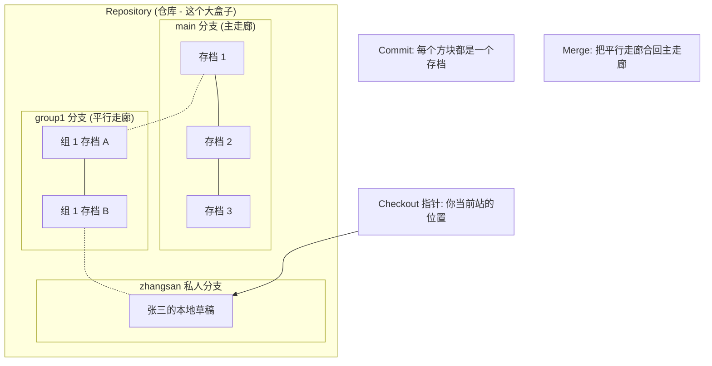
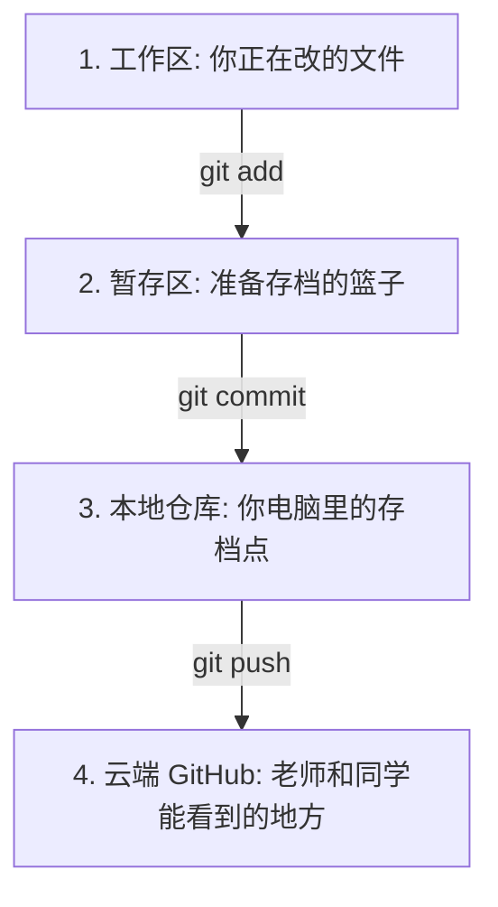
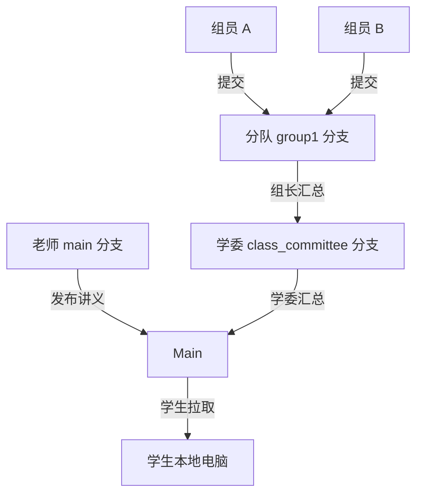
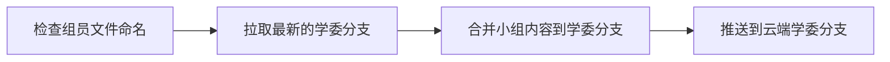
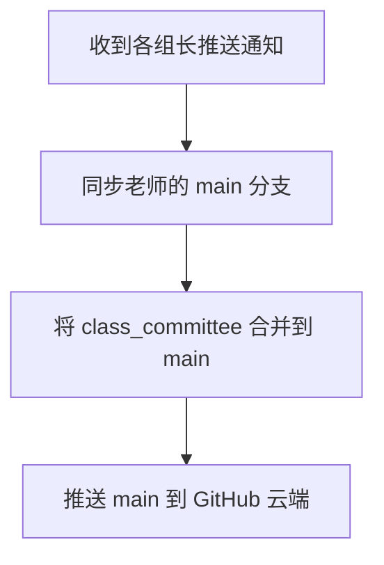

# GitHub 全流程实战“百科全书”：从 0 到 1 玩转同班协作 (0114 AI 班级)

> **写在前面 (For 0 基础同学)**：
> 亲爱的同学，如果你觉得“代码、终端、Git”这些词听起来像天书，这本手册就是为你准备的。
> 我们不讲枯涩的理论，只讲：**这个词是什么意思？我该点哪里？我报错了怎么办？**

---

## 🏗️ 目录 (Table of Contents)
1.  [【必读】Git 词典：用大白话解释专业名词](#1)
2.  [【直观】图解：我的代码是怎么跑到 GitHub 上的？](#2)
3.  [【实战：组员篇】我的每日作业提交全流程](#3)
4.  [【实战：组长篇】如何“审核”并汇总组员的工作？](#4)
5.  [【实战：学委篇】全班大汇总的艺术](#5)
6.  [【实战：老师篇】资料分发的源头](#6)
7.  [【网站篇】GitHub 网页上的那些按钮都是干嘛的？](#7)
8.  [【求救篇】小白最常遇到的 常见“红字”报错及解决方法](#8)

---

<a name="1"></a>
## 📖 第一章：Git 词典 - 大白话版

### 1.1 核心概念图：代码的“大型档案盒”

很多同学搞不懂分支和仓库的关系，我们用一个“大盒子”来表示：



### 1.2 常用名词解释

| 英文命令 | 大白话翻译 | 生活中的类比 |
| :--- | :--- | :--- |
| **`Repository (Repo)`** | **仓库** | 一个文件夹，但它带“后悔药”（能找回删掉的文件）。 |
| **`Branch`** | **分支** | 文件夹的“平行空间”。你可以从上面那个大盒子里分出很多平行线。 |
| **`Checkout`** | **切换/结账** | 实际上是“跳台”。`checkout` 到哪，你就站在哪条线上（看上图的指针）。 |
| **`Clone`** | **克隆** | 把云端的档案盒，原封不动复印一份到你电脑里。 |
| **`Pull`** | **拉取/更新** | 看看大号档案盒（GitHub）有没有新档案，拉下来更新到我手里的盒子里。 |
| **`Push`** | **推送/上传** | 把我自己盒子里新增的档案，传到 GitHub 那个大盒子里。 |
| **`Add`** | **标记/打包** | 把你要交的作业放进快递盒。 |
| **`Commit`** | **存档/拍快照** | 在快递盒上贴个条写明：“这是 25 号的成果”。（就是图里的小圆点） |
| **`Merge`** | **合并** | 把两条平行的走廊连在一起。 |

---

<a name="2"></a>

## 🎨 第二章：图解 - 代码的旅行

### 2.1 文件流转图 (我本地是怎么操作的？)

很多同学 `commit` 了却发现云端没变，是因为没经过最后一步 `push`。


### 2.2 仓库结构图 (咱们班的仓库是怎么分的？)

班级仓库：`https://github.com/haozhiping/0114ai-course`


---

<a name="3"></a>

## 🧑‍💻 第三章：组员篇 (Member) - 最详细的实操

### 3.1 第一次入场 (初始化)

1.  找到一个你放代码的盘（比如 D 盘）。
2.  右键 `Git Bash Here`。
3.  输入：
    ```bash
    git clone https://github.com/haozhiping/0114ai-course
    cd 0114ai-course
    ```

### 3.2 每天晚上和早上的“基本操作”

开工前，一定要先拿老师最新的资料：
```bash
git checkout main
git pull origin main
```

### 3.3 提交作业的“标准动作” (以第 1 组张三为例)

#### 动作 A：切换到你的小组阵地

```bash
git checkout group1
git pull origin group1 # 看看组长有没有新上传内容
```

#### 动作 B：开启你的私人空间（千万别直接在小组分支改！）

> [!IMPORTANT]
> **重点理解命令：`git checkout -b task_0325_zhangsan`**  
> 很多同学问：为什么不先 `create` 分支？其实这行命令是一个**“二合一”快捷键**：
>
> 1.  **创建 (Create)**：先帮你建好一个叫 `task_0325_zhangsan` 的新分支。
> 2.  **切换 (Switch)**：立即把你从原来的位置“瞬移”到这个新分支上。
>
> 如果你不习惯用快捷键，也可以拆成两步做（效果一模一样）：
> ```bash
> # 1. 先创建 (原地踏步，只是建了个新空间)
> git branch task_0325_zhangsan
> # 2. 后切换 (跳进新空间)
> git checkout task_0325_zhangsan
> ```

#### 动作 C：写代码/记笔记

*   去 `2_笔记` 文件夹。
*   新建文件：`20240325_张三_RAG.md`。

#### 动作 D：存档三部曲（Add -> Commit -> Push）

**1. 标记文件 (Add)**：
> [!TIP]
> **关于 `git add` 的精准操作**：
> *   `git add .` —— **一键全收**：把当前文件夹里所有变动的文件都放进篮子。最省事，但也容易把临时的垃圾文件也收进去。
> *   `git add 文件名` —— **精准点名**：只把某一个文件放进篮子。
>     *   示例：`git add 20240325_张三_RAG.md`
> *   `git add 文件夹名/` —— **按组打包**：把整个文件夹里的内容放进篮子。
>
> **建议**：初学者可以用 `git add .`，但如果你只想交作业，不想把别的草稿交上去，建议使用 `git add 具体文件名`。

```bash
# 执行标记
git add . 
# 执行存档
git commit -m "feat: 张三提交 0325 笔记"
# 3. 回到小组分支准备上交
git checkout group1
git merge task_0325_zhangsan
# 4. 真正传到 GitHub
git push origin group1
```

---

<a name="4"></a>

## 🧑‍✈️ 第四章：组长篇 (Group Leader) - 审核与汇总

### 4.1 组长的责任

你要确保小组的分支 `groupX` 不乱，并且定时把成果交到学委的 `class_committee` 分支。

### 4.2 组长汇总图



### 4.3 组长实操
```bash
# 1. 先同步学委分支
git checkout class_committee
git pull origin class_committee

# 2. 也是最重要的一步：合并你的小组
git merge group1 

# 3. 如果没报错，直接 push
git push origin class_committee
```

---

<a name="5"></a>

## 🎓 第五章：学委篇 (Class Committee) - 全班汇总

### 5.1 学委汇总流程



### 5.2 详细操作

```bash
git checkout main
git pull origin main
git merge class_committee
git push origin main
```

---

<a name="7"></a>
## 🌐 第七章：GitHub 网页版指南

当你打开 `https://github.com/haozhiping/0114ai-course` 时：

1.  **Branch 按钮**：在左上角。点击它，你可以切换看到 `group1`、`group2` 等。如果你在 group 看不到作业，记得到这里换分支看！
2.  **Star (星星)**：右上角。收藏本项目，以后在你的个人主页就能点击快速进来。
3.  **Fork (分叉)**：如果你想把 OpenClaw 这种库搬回自己家研究，点这个。
4.  **Issue (问题)**：有什么不懂的，想公开问老师，可以在这里发帖。

---

<a name="8"></a>
## 📝 第八章：规范篇 - 如何写出高大上的提交信息？

很多同学在做 `git commit` 时，消息喜欢乱写（比如 `111`、`aaa`）。在企业开发中，大多数企业都会有固定规范。
为了像专业开发一样思考，我们需要给提交信息带上“前缀”。

### 8.1 常用前缀大揭秘

| 前缀 | 全称 | 什么时候用？ | 生活类比 |
| :--- | :--- | :--- | :--- |
| **`feat:`** | **feature** | **新增了功能或内容**。比如写了新笔记、交了新作业。 | 盖房子：增加了一层楼。 |
| **`fix:`** | **fix** | **修复了错误**。比如发现笔记写错了，或者代码有 Bug。 | 盖房子：修好了漏水的管子。 |
| **`docs:`** | **documentation** | **只改了文档**。比如修改了 README，或者加了一段注释。 | 盖房子：修改了说明书。 |
| **`refactor:`** | **refactor** | **代码重构**。没加功能也没修 Bug，只是把代码理顺了。 | 盖房子：把房间重新装修了一下。 |
| **`style:`** | **style** | **格式改动**。比如加了空格、改了缩进，不影响逻辑。 | 盖房子：把墙刷了新颜色。 |

### 8.2 老师的要求

从今天起，大家的提交信息请统一格式：
`前缀: 日期-姓名-具体干了啥`

*   **优秀案例**：`feat: 0325-张三-完成RAG模块作业`
*   **优秀案例**：`fix: 修正笔记中的错别字`
*   **错误案例**：`111` (禁止出现)
*   **错误案例**：`提交` (太抽象)

---

<a name="9"></a>

## 🆘 第九章：救命！我报错了！(小白 FAQ)

### Q1: 提示 `Authentication failed` (登录失败)？

*   **因为**：GitHub 现在不让用密码登录了。
*   **解药**：你需要配置 **Personal Access Token (PAT)** 或者 **SSH Key**。建议找AI或老师协助配置一次。

### Q2: 提示 `Merge Conflict` (合并冲突)？

*   **原因**：你跟同学改了同一个文件的同一行。
*   **解药**：
    1.  打开 VS Code 或 PyCharm。
    2.  找到带红色的文件。
    3.  你会看到 `Accept Current Change` 或 `Accept Incoming Change` 的按钮。
    4.  点一个你认为对的，保存。
    5.  重新执行 `git add .` 和 `git commit`。

### Q3: 提示 `Rejected ... non-fast-forward`？

*   **原因**：云端已经有新内容了，你没拉就想推。
*   **解药**：先 `git pull` 一下。

### Q4: 我想找 OpenClaw 这个库，怎么找？

*   在 GitHub 顶部的搜索框直接搜 `OpenClaw`。
*   进入后，点 **Star** 收藏，点 **Code** -> **Download ZIP** 直接下载到本地玩。

### Q5: 我想汉化GitHub？

*   点到这个地址：
https://github.com/maboloshi/github-chinese/blob/gh-pages/README.md
    看下readme.md文件，按照步骤操作即可

### Q6: 有没有办法不开梯子拉取代码？

*    解压fastgithub_win-x64.zip安装。运行后即可自动配置系统代理，实现无需梯子即可访问GitHub。

---

## 🏁 结语：给小白的真心话

Git 看起来像迷宫，但其实它只有一条路：**同步 -> 改动 -> 存档 -> 推送**。
大家都是从报错中走过来的。不要怕，大不了删了文件夹重新 `clone`！加油！
