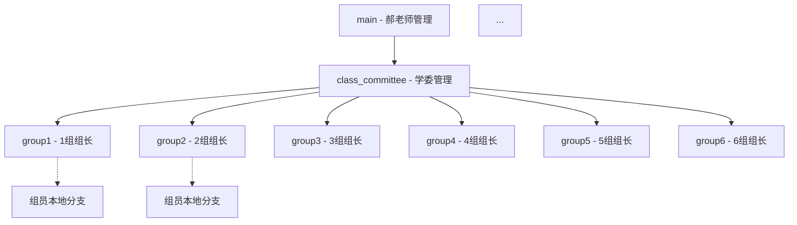

# 🚀 0114 AI 大模型课程

欢迎来到 **0114 班级** 大模型学习与实战项目仓库！本仓库旨在通过系统化的课件学习、每日笔记总结、作业实练以及阶段性考试，助力同学们成长为优秀的 AI 大模型工程师。

---

## 📂 目录结构说明

为了方便教学管理与资源沉淀，请大家严格遵守以下目录规范：

| 目录名称 | 内容描述 | 更新频率 |
| :--- | :--- | :--- |
| **`1_课件`** | 包含 6 大核心模块（深度学习、RAG、Agent、工具实战、微调、项目面试）的教学资料。 | 老师每日更新 |
| **`2_笔记`** | 同学们的每日学习心得、知识点总结。 | 同学每日提交 |
| **`3_作业`** | 课程配套的动手实操练习。 | 根据进度提交 |
| **`4_通用资料`** | 常用文档、GitHub 使用指南、环境配置手册等。 | 不定期更新 |
| **`5_考试`** | 阶段性测验及结业考核题目与答案提交。 | 考试时使用 |

---

## 📏 命名与提交规范 (CRITICAL)

良好的命名规范是高效协作的基石，请每位同学严格遵守：

### 1. 文件命名规则
所有提交的文件请使用以下前缀命名：
`日期_姓名_内容描述`
*   示例：`张三_RAG模块笔记.md`
*   示例：`李四_Agent作业1.ipynb`

### 2. 文件夹管理逻辑
各组提交内容时，请按组别建立子目录，并按日期归类：
`组别文件夹` -> `日期文件夹` -> `个人文件`
*   路径示例：`2_笔记/group1/20240325/张三_笔记.md`

---

## 🛠️ 分支协作流程

本项目采用 **多级分支管理模式**，确保主线稳定，协作有序。

### 分支图结构


### 角色指南与常用命令

> [!NOTE]
> 组员**不需要**在云端创建个人分支，仅在本地创建临时分支并合并到所属组的云端分支。

#### 🔹 组员 (Member)
1.  **同步云端进度**：`git pull origin group[N]` (N 为所属组号)
2.  **创建本地工作分支**：`git checkout -b feat_mywork`
3.  **完成作业/笔记** (记得按规范命名及存放路径)
4.  **合并到组分支**：
    ```bash
    git checkout group[N]
    git merge feat_mywork
    ```
5.  **推送到云端**：`git push origin group[N]`

#### 🔸 组长 (Group Leader)
1.  **汇总并清理组内代码**。
2.  **向学委分支提交合并申请**：
    ```bash
    git checkout class_committee
    git pull origin class_committee
    git merge group[N]
    git push origin class_committee
    ```

#### 🎓 学委 (Class Committee)
1.  **汇总全班进度**。
2.  **合并到老师的 main 分支**：
    ```bash
    git checkout main
    git pull origin main
    git merge class_committee
    git push origin main
    ```

---

## 💡 友情提醒
*   在每次工作开始前，请养成先 `git pull` 同步最新代码的习惯。
*   如有合并冲突，请各组内部先行协商解决，或及时联系学委及老师。
*   保持 README 的整洁，共同维护我们的学习社区！